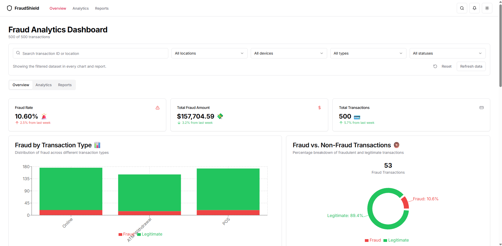

# FraudShield

FraudShield is an AI-powered fraud detection and analytics project for exploring suspicious financial transactions through machine learning, explainable AI, SQL analysis, and an interactive Next.js dashboard.



## What it includes

- Interactive fraud analytics dashboard built with Next.js, React, Tailwind CSS, Recharts, and Lucide icons.
- Transaction-level exploration with filtering, fraud-rate summaries, risk indicators, trends, and visual breakdowns.
- Python training pipeline using Pandas, scikit-learn, imbalanced-learn, PyTorch, and SHAP.
- Multiple classification approaches, including logistic regression, random forest, gradient boosting, SVM, and an LSTM model.
- SQL analysis examples in `fraud_transactions_insights.sql`.
- Supporting Power BI and exploratory analysis screenshots in `Screenshot/`.

## Project structure

```text
.
├── fraud_dataset_500.csv          # Sample transaction data
├── fraud_model.py                  # Data preparation and model training
├── fraud_lstm_model.pth            # Saved PyTorch model weights
├── shap_analysis.py                # Model explainability analysis
├── fraud_transactions_insights.sql # SQL analysis queries
├── Screenshot/                     # Dashboard and reporting screenshots
└── fraud-dashboard/                # Next.js analytics dashboard
```

## Machine learning workflow

1. Load and clean the transaction dataset.
2. Encode categorical fields such as location, device, and transaction type.
3. Standardize numerical features and engineer transaction-hour signals.
4. Use SMOTE to reduce the impact of class imbalance.
5. Train and compare traditional classifiers and a PyTorch LSTM.
6. Use SHAP to inspect feature importance and prediction explanations.

## Run the dashboard

### Prerequisites

- Node.js 18 or newer
- npm
- Python 3.9 or newer for the model scripts

### Install and start

```bash
cd fraud-dashboard
npm install
npm run dev
```

Open [http://localhost:3000](http://localhost:3000) to view the dashboard.

The dashboard currently loads the sample transaction data from the data source configured in `fraud-dashboard/lib/data.ts`.

## Run the Python analysis

Create a virtual environment, install the required Python packages, and run the scripts from the repository root:

```bash
python -m venv .venv

# Windows PowerShell
.venv\Scripts\Activate.ps1

pip install pandas numpy matplotlib seaborn scikit-learn imbalanced-learn \
  torch shap joblib flask

python fraud_model.py
python shap_analysis.py
```

The training and explainability scripts generate console output and analysis plots. Review the script configuration before running SHAP analysis if the expected serialized model file is not available locally.

## More screenshots

| Next.js dashboard | Power BI report |
| :---: | :---: |
|  |  |


## Author

**Shivam Dhangdharia**

- [LinkedIn](https://www.linkedin.com/in/shivam1232/)
- [GitHub](https://github.com/Shivam-1232)